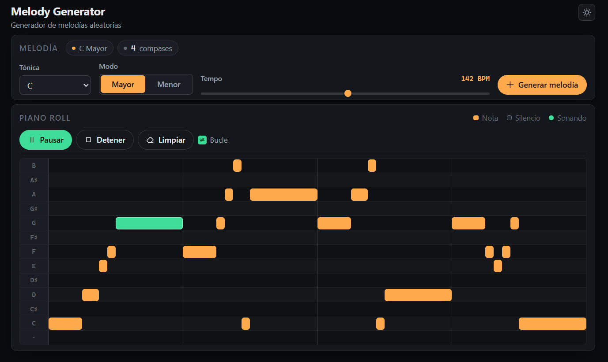

# Melody Generator — Backend

Backend del generador de melodías: genera melodías musicalmente correctas a partir de una
escala, y gestiona los usuarios de la aplicación.

Este repositorio es **la parte de servidor**. El frontend (Angular) tiene su propio repositorio.
https://github.com/DNaviaG/MelodyGeneratorFront



## Qué hace el proyecto

El generador no produce notas al azar. Aplica teoría musical:

- **Todos los acordes son diatónicos** a la escala pedida. En `Do menor`, el `ii` es
  `D F A♭` (disminuido) y no `D F A`: la tabla de modos manda, no el nombre del grado.
- **Los tiempos fuertes llevan nota del acorde.** Las unidades 0 y 8 de cada compás
  (negras 1 y 3) son notas del acorde; la melodía respira con notas de paso en los tiempos
  débiles, y nunca más de una seguida.
- **La melodía resuelve.** La última nota de cada melodía es la raíz o la quinta del acorde,
  nunca la tercera.
- **Los silencios tienen reglas.** Van detrás de la última nota del compás que está sobre la
  dominante, y solo si esa nota cae en un tiempo débil. Nunca en el último compás, porque
  entonces la cadencia final se quedaría sin resolver.
- **Es determinista.** `MelodyMaker.generateMelody(scale, seed)` con la misma semilla
  devuelve siempre la misma melodía. Es lo que hace que el resultado se pueda medir.

Todo esto se comprobó midiendo 8000 compases por modo (2000 melodías × 4 compases ×
`MAJOR` y `MINOR`): 0 notas fuera de la escala, todos los compases suman 16 unidades,
0 acentos con nota ajena al acorde, 0 melodías que acaban en la tercera.

## Stack

| | |
|---|---|
| Java | 21 (LTS) |
| Spring Boot | 4.1.1 |
| Persistencia | Spring Data JPA · Hibernate 7 · PostgreSQL |
| Seguridad | `spring-security-crypto` (BCrypt) · `jjwt` 0.12.6 |
| Documentación | springdoc-openapi (Swagger UI) |
| Otros | Lombok |

## Endpoints

| Método | Ruta | Qué hace |
|---|---|---|
| `POST` | `/api/melody/generate` | Genera una melodía. Body: `{ "rootNote": "C", "mode": "MAJOR" }` |
| `POST` | `/api/auth/login` | Inicia sesión. Body: `{ "email": …, "password": … }`. Devuelve el token |
| `POST` | `/api/users` | Registra un usuario (contraseña hasheada con BCrypt) |
| `GET` | `/api/users` | Lista usuarios |
| `GET` | `/api/users/{id}` | Un usuario |
| `PATCH` | `/api/users/{id}` | Actualiza parcialmente |
| `DELETE` | `/api/users/{id}` | Borra un usuario |

Swagger: `http://localhost:8080/swagger-ui.html`

`NoteName` acepta `C`, `C_SHARP`, `D_FLAT`… y también `REST`. `Mode` acepta `MAJOR` y `MINOR`.

## Cómo arrancarlo

Hace falta una base de datos PostgreSQL **vacía** llamada `melody_generator`. El esquema lo
crea Hibernate (`ddl-auto=update`), así que no hay ningún SQL que lanzar.

Dos secretos vienen de variable de entorno, y la aplicación **no arranca sin ellos**
(fail fast):

```powershell
$env:DB_PASSWORD="..."
$env:JWT_SECRET="...al menos 32 caracteres..."
.\mvnw.cmd spring-boot:run
```

`JWT_SECRET` tiene un mínimo de 32 bytes: es lo que exige el algoritmo HMAC-SHA de JWT,
y `jjwt` falla antes de firmar si la clave es débil.

## Estructura

```
model/       las reglas de negocio: lo que usa el generador (NoteName, Mode, Scale, Duration…)
entity/      lo que se guarda en la base de datos (UserEntity, RoleEntity, MelodyEntity)
dto/         lo que sale por la API (dto/melody, dto/user, dto/auth)
repository/  las puertas a la base de datos
service/     la lógica de aplicación (UserService, AuthService, MelodyService, TokenService)
controller/  los endpoints
musicLogic/  el generador: MusicTheory, MelodyMaker, MeasureGenerator, MeasureNoteGenerator
config/      los beans (PasswordEncoder)
```

La separación entre `model`, `entity` y `dto` es la decisión de diseño que más pesa aquí:
son tres cosas distintas con tres consumidores distintos. El mismo `Note` no puede ser las
tres, porque cualquier cambio en la base de datos cambiaría el JSON, y al revés.